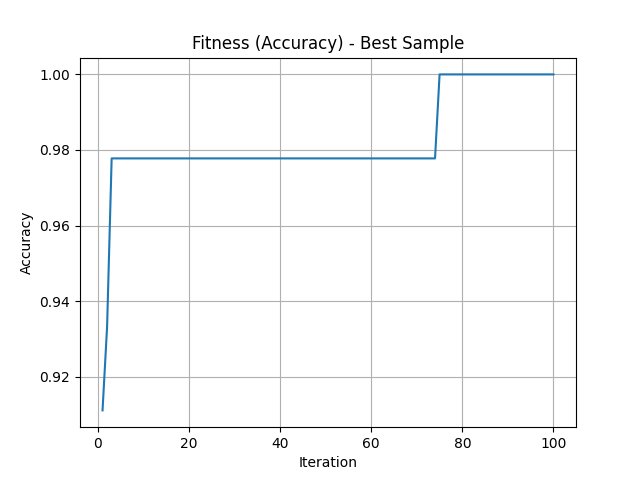

# SVM Parameter Optimization using Random Search (Iris Dataset)

This project implements a simple **random search algorithm** to optimize the hyperparameters of a **Support Vector Machine (SVM)** for classifying the UCI Iris dataset. The goal is to **maximize accuracy** by tuning the following parameters:

## 🔧 Parameters Optimized
- **nu**: Random float in [0, 1]
- **epsilon**: Random float in [0, 1]
- **kernel**: Random selection from ['rbfdot', 'polydot', 'vanilladot', 'tanhdot', 'laplacedot', 'anovadot']

## 🧠 Algorithm Flow :
1. Initialize `BestFitness = 0`, `BestParameter = None`
2. Generate random parameters
3. Train SVM and compute fitness (accuracy)
4. If accuracy > BestFitness, update BestFitness and BestParameter
5. Repeat until stopping condition (e.g. max iterations)
6. Return best parameters and accuracy

## 📈 Output
- Best parameter set found
- Corresponding accuracy
- Accuracy graph saved as PNG
- Result table saved as CSV

## 📊 Results Table
| Sample #   |   Best Accuracy | Best Parameters (Kernel, C)   |
|:-----------|----------------:|:------------------------------|
| S1         |          1      | ('laplacedot', 0.25)          |
| S2         |          0.9778 | ('vanilladot', 5.3)           |
| S3         |          1      | ('vanilladot', 6.61)          |
| S4         |          0.9556 | ('anovadot', 3.7)             |
| S5         |          0.9778 | ('vanilladot', 4.8)           |
| S6         |          0.9778 | ('polydot', 5.75)             |
| S7         |          0.9778 | ('vanilladot', 8.01)          |
| S8         |          0.9556 | ('vanilladot', 6.89)          |
| S9         |          0.9556 | ('laplacedot', 1.11)          |
| S10        |          1      | ('vanilladot', 9.95)          |

## 🖼️ Graph

